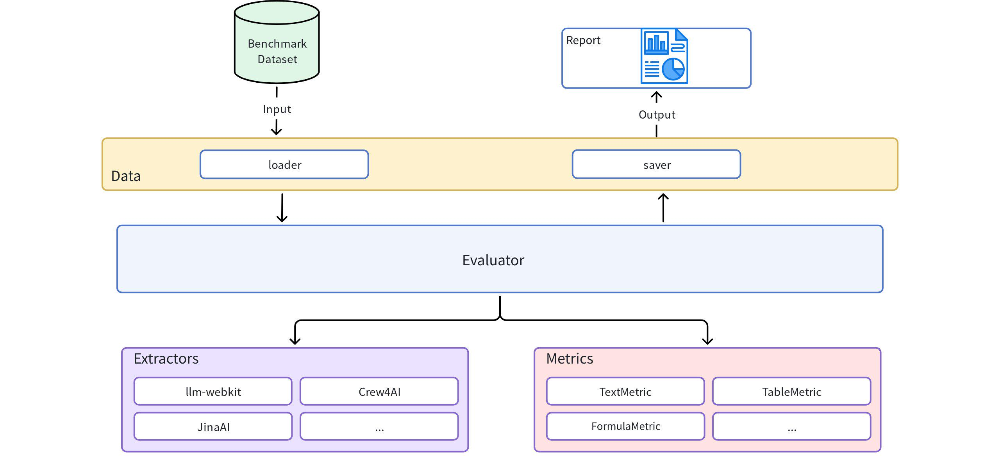

# WebMainBench

WebMainBench 是一个专门用于端到端评测网页正文抽取质量的基准测试工具。

## 功能特点

### 🎯 **核心功能**
- **多抽取器支持**: 支持 LLM-WebKit、Jina AI 等多种抽取工具
- **全面的评测指标**: 包含文本编辑距离、表格结构相似度(TEDS)、公式抽取质量等多维度指标
- **人工标注支持**: 评测数据集100%人工标注

#### 指标详细说明

| 指标名称 | 计算方式 | 取值范围 | 说明 |
|---------|----------|----------|------|
| `overall` | 所有成功指标的平均值 | 0.0-1.0 | 综合质量评分，分数越高质量越好 |
| `text_edit` | `1 - (编辑距离 / 最大文本长度)` | 0.0-1.0 | 纯文本相似度，分数越高质量越好 |
| `code_edit` | `1 - (编辑距离 / 最大代码长度)` | 0.0-1.0 | 代码内容相似度，分数越高质量越好 |
| `table_TEDS` | `1 - (树编辑距离 / 最大节点数)` | 0.0-1.0 | 表格结构相似度，分数越高质量越好 |
| `table_edit` | `1 - (编辑距离 / 最大表格长度)` | 0.0-1.0 | 表格内容相似度，分数越高质量越好 |
| `formula_edit` | `1 - (编辑距离 / 最大公式长度)` | 0.0-1.0 | 公式内容相似度，分数越高质量越好 |


### 🏗️ **系统架构**



### 🔧 **核心模块**
1. **data 模块**: 评测集文件和结果的读写管理
2. **extractors 模块**: 各种抽取工具的统一接口
3. **metrics 模块**: 评测指标的计算实现
4. **evaluator 模块**: 评测任务的执行和结果输出


## 快速开始

### 安装

```bash
# 基础安装
pip install webmainbench

# 安装所有可选依赖
pip install webmainbench[all]

# 开发环境安装
pip install webmainbench[dev]
```

### 基本使用

```python
from webmainbench import DataLoader, Evaluator, ExtractorFactory

# 1. 加载评测数据集
dataset = DataLoader.load_jsonl("your_dataset.jsonl")

# 2. 创建抽取器
extractor = ExtractorFactory.create("llm-webkit")

# 3. 运行评测
evaluator = Evaluator()
result = evaluator.evaluate(dataset, extractor)

# 4. 查看结果
print(f"Overall Score: {result.overall_metrics['overall']:.4f}")
```

### 数据格式

评测数据集应包含以下字段：

```jsonl
{
  "track_id": "0b7f2636-d35f-40bf-9b7f-94be4bcbb396",
  "html": "<html><body><h1 cc-select=\"true\">这是标题</h1></body></html>",   # 人工标注带cc-select="true" 属性
  "groundtruth_content": "# 标题\n\n正文内容",
  "groundtruth_content_list": [
      {"type": "heading", "content": "标题", "level": 1},
      {"type": "paragraph", "content": "正文内容"}
   ],
  "url": "https://orderyourbooks.com/product-category/college-books-p-u/?products-per-page=all",
  "layout_id": "orderyourbooks.com_4",
  "max_layer_n": 10,
  "url_host_name": "orderyourbooks.com",
  "raw_warc_path": "s3://cc-raw-huawei/crawl-data/CC-MAIN-2025-13/segments/1742004433093.21/warc/CC-MAIN-20250319080618-20250319110618-00909.warc.gz?bytes=461610805,172252",
  "language": "en",
  "__dom_depth": 19,
  "__dom_width": 10231,
  "__type": "__max_depth",
  "__tag": "DOM_WIDTH",
  "marked_type": "unwanted",  # normal：正常标注的网页；unable：正文内容无法抉择；unwanted：无需标注的网页；
  "unwanted_reason": "list"
}
```

## 支持的抽取器

- **LLM-WebKit**: 基于大语言模型的智能抽取
- **Jina AI**: Reader API 服务
- **自定义抽取器**: 通过继承 `BaseExtractor` 实现


## 高级功能

### 多抽取器对比评估

```python
# 对比多个抽取器
extractors = ["llm-webkit", "jina-ai"]
results = evaluator.compare_extractors(dataset, extractors)

for name, result in results.items():
    print(f"{name}: {result.overall_metrics['overall']:.4f}")
```

#### 具体示例

```python
python examples/multi_extractor_compare.py
```

这个例子演示了如何：

1. **加载测试数据集**：使用包含代码、公式、表格、文本等多种内容类型的样本数据
2. **创建多个抽取器**：
   - `llm-webkit`：支持预处理HTML的智能抽取器
   - `magic-html`：基于 magic-html 库的抽取器
   - `trafilatura`：基于 trafilatura 库的抽取器  
   - `resiliparse`：基于 resiliparse 库的抽取器
3. **批量评估对比**：使用 `evaluator.compare_extractors()` 同时评估所有抽取器
4. **生成对比报告**：自动保存多种格式的评估结果

#### 输出文件说明

评估完成后会在 `results/` 目录下生成三个重要文件：

| 文件名 | 格式 | 内容描述 |
|--------|------|----------|
| `leaderboard.csv` | CSV | **排行榜文件**：包含各抽取器的整体排名和分项指标对比，便于快速查看性能差异 |
| `evaluation_results.json` | JSON | **详细评估结果**：包含每个抽取器的完整评估数据、指标详情和元数据信息 |
| `dataset_with_results.jsonl` | JSONL | **增强数据集**：原始测试数据加上所有抽取器的提取结果，便于人工检查和分析 |


`leaderboard.csv` 内容示例：
```csv
extractor,dataset,total_samples,success_rate,overall,code_edit,formula_edit,table_TEDS,table_edit,text_edit
llm-webkit,sample_dataset,4,1.0,0.2196,0.5,0.0,0.0,0.0,0.5982
magic-html,sample_dataset,4,1.0,0.1526,0.1007,0.0,0.0,0.0,0.6624
resiliparse,sample_dataset,4,1.0,0.1379,0.0,0.0,0.0,0.0,0.6897
trafilatura,sample_dataset,4,1.0,0.1151,0.1007,0.0,0.0,0.0,0.4746
```

### 自定义指标

```python
from webmainbench.metrics import BaseMetric, MetricResult

class CustomMetric(BaseMetric):
    def _setup(self):
        pass
    
    def _calculate_score(self, predicted, groundtruth, **kwargs):
        # 实现自定义评测逻辑
        score = your_calculation(predicted, groundtruth)
        return MetricResult(
            metric_name=self.name,
            score=score,
            details={"custom_info": "value"}
        )

# 添加到评测器
evaluator.metric_calculator.add_metric("custom", CustomMetric("custom"))
```

### 自定义抽取器

```python
from webmainbench.extractors import BaseExtractor, ExtractionResult

class MyExtractor(BaseExtractor):
    def _setup(self):
        # 初始化抽取器
        pass
    
    def _extract_content(self, html, url=None):
        # 实现抽取逻辑
        content = your_extraction_logic(html)
        
        return ExtractionResult(
            content=content,
            content_list=[...],
            success=True
        )

# 注册自定义抽取器
ExtractorFactory.register("my-extractor", MyExtractor)
```

## 项目架构

```
webmainbench/
├── data/           # 数据处理模块
│   ├── dataset.py  # 数据集类
│   ├── loader.py   # 数据加载器
│   └── saver.py    # 数据保存器
├── extractors/     # 抽取器模块
│   ├── base.py     # 基础接口
│   ├── factory.py  # 工厂模式
│   └── ...         # 具体实现
├── metrics/        # 指标模块
│   ├── base.py     # 基础接口
│   ├── text_metrics.py    # 文本指标
│   ├── table_metrics.py   # 表格指标
│   └── calculator.py      # 指标计算器
├── evaluator/      # 评估器模块
│   └── evaluator.py       # 主评估器
└── utils/          # 工具模块
    └── helpers.py          # 辅助函数
```


## 许可证

本项目采用 MIT 许可证 - 查看 [LICENSE](LICENSE) 文件了解详情。
